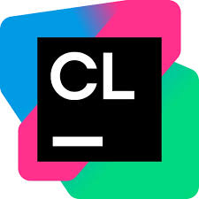
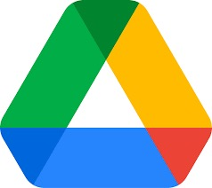

<h2>My Experience</h2>

  SAEROM HIGH SCHOOL
  TechWorks
   
  KONKUK UNIVERSITY
   
  2026 상반기 Code Club

<h2>My Certificate</h2>

  <a href="image/My_Certificate/AI_Fundamentals.JPG" target="_blank">AI Fundamentals</a>
  <a href="image/My_Certificate/AI_for_Brainstorming_and_Planning.JPG" target="_blank">AI for Brainstorming and Planning</a>
  <a href="image/My_Certificate/AI_for_Research_and_Insights.JPG" target="_blank">AI for Research and Insights</a>
   
  <a href="image/My_Certificate/Python_Data_Analysis.pdf" target="_blank">2026-1학기 온라인학습법특강 8: 파이썬 라이브러리를 활용한 데이터 분석</a>

<h2>My Tech</h2>

  HTML
  CSS
  JavaScript
   
  Python
  Selenium
  Flask
   
  C
   
  SQL

<h2>My Tool</h2>

  Visual Studio Code
  PyCharm
  CLion
   
  Google Sites
  Google Apps Script
  Vercel
   
  Google Sheets
  SQLite
   
  Google Drive
  Google Docs
  GitHub

<h2>My Community</h2>

  <a href="https://youtube.com/@dok-0727?si=yvRh6_Mbwh75F2K7" target="_blank">YouTube</a>
  <a href="https://www.instagram.com/dok_0727?igsh=MWllN2VkYjJhdGtqeg%3D%3D&utm_source=qr" target="_blank">Instagram</a>
  <a href="https://kr.linkedin.com/in/도경-한-2b04a13aa" target="_blank">LinkedIn</a>

